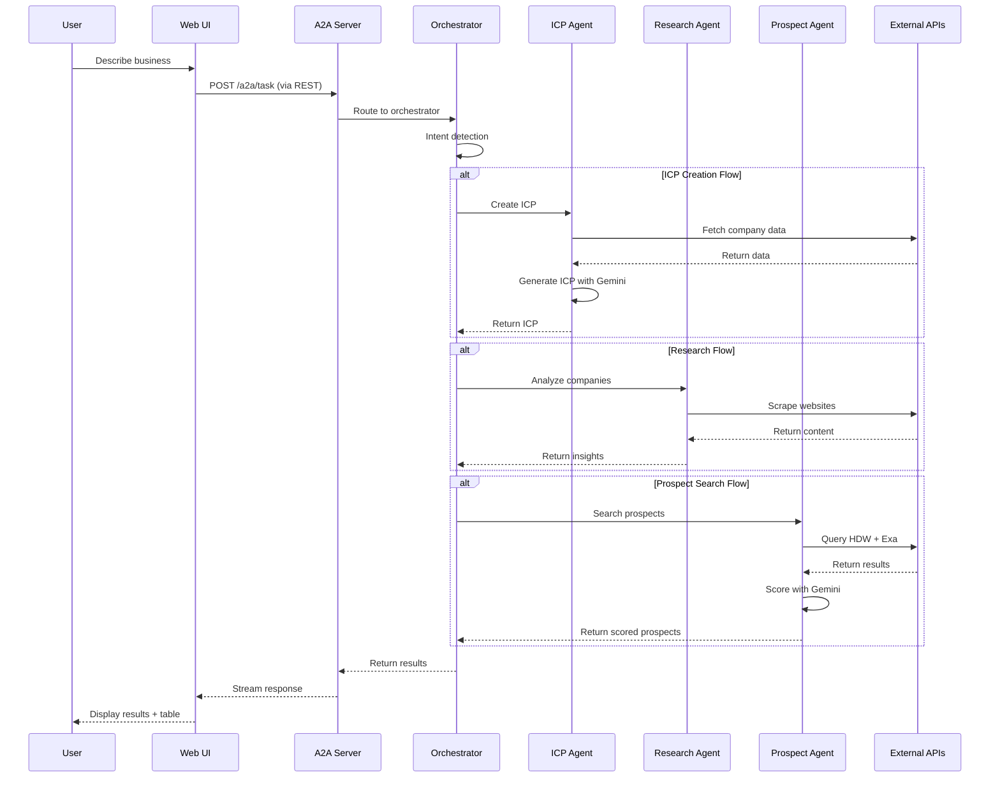
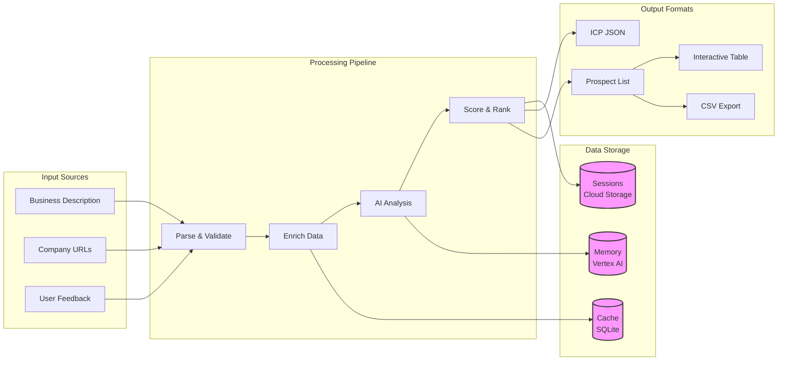
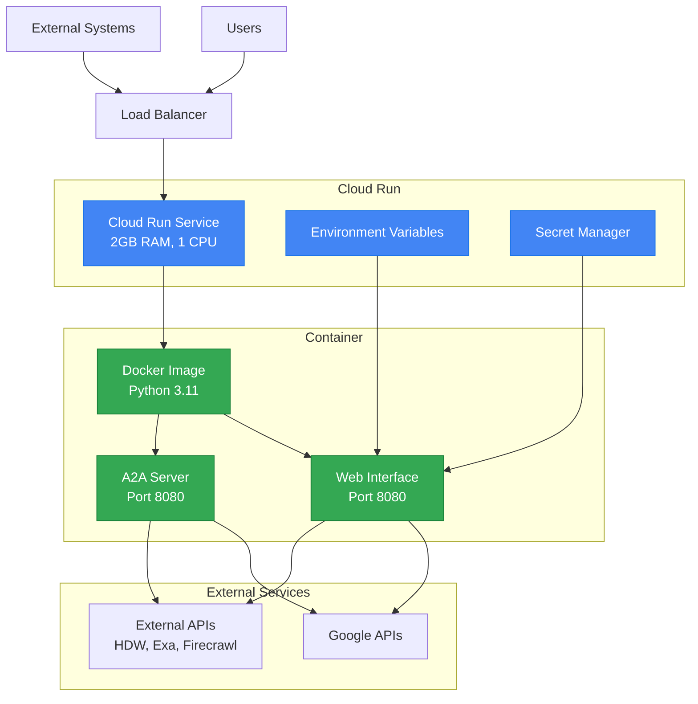

# System Architecture Diagram

## Complete System Architecture

```mermaid
graph TB
    subgraph "Client Layer"
        UI[Web Interface<br/>Gradio UI]
        API[A2A Client<br/>External Systems]
        WS[WebSocket<br/>Clients]
    end

    subgraph "A2A Protocol Layer"
        REST[REST API<br/>FastAPI Server]
        WSS[WebSocket Server]
        REGISTRY[Agent Registry<br/>& Health Monitor]
        
        REST --> DISC[/a2a/discovery]
        REST --> CAP[/a2a/capabilities]
        REST --> TASK[/a2a/task]
        REST --> HEALTH[/health]
        REST --> METRICS[/metrics]
    end

    subgraph "Orchestration Layer"
        ORCH[ADK Agent Orchestrator]
        INTENT[Intent Detection<br/>Gemini 1.5]
        WORKFLOW[Workflow Engine<br/>State Machine]
        MEMORY[Memory Manager<br/>Vertex AI]
    end

    subgraph "Agent Layer"
        ICP[ICP Agent<br/>9 capabilities]
        RESEARCH[Research Agent<br/>9 capabilities]
        PROSPECT[Prospect Agent<br/>12 capabilities]
    end

    subgraph "External Data Sources"
        HDW[HorizonDataWave<br/>LinkedIn Data]
        EXA[Exa AI<br/>Web Intelligence]
        FIRE[Firecrawl<br/>Web Scraping]
    end

    subgraph "Google Cloud Services"
        GEMINI[Gemini 1.5 Pro<br/>LLM]
        VERTEX[Vertex AI<br/>Memory & Storage]
        STORAGE[Cloud Storage<br/>Session Data]
    end

    %% Client connections
    UI --> REST
    API --> REST
    WS --> WSS
    
    %% A2A to Orchestration
    REST --> REGISTRY
    WSS --> REGISTRY
    REGISTRY --> ORCH
    
    %% Orchestration connections
    ORCH --> INTENT
    INTENT --> WORKFLOW
    WORKFLOW --> ICP
    WORKFLOW --> RESEARCH
    WORKFLOW --> PROSPECT
    ORCH --> MEMORY
    
    %% Agent to External APIs
    ICP --> HDW
    ICP --> FIRE
    RESEARCH --> HDW
    RESEARCH --> EXA
    RESEARCH --> FIRE
    PROSPECT --> HDW
    PROSPECT --> EXA
    
    %% Google Cloud connections
    ORCH --> GEMINI
    ICP --> GEMINI
    RESEARCH --> GEMINI
    PROSPECT --> GEMINI
    MEMORY --> VERTEX
    MEMORY --> STORAGE

    classDef client fill:#e1f5fe,stroke:#01579b,stroke-width:2px
    classDef a2a fill:#f3e5f5,stroke:#4a148c,stroke-width:2px
    classDef agent fill:#e8f5e9,stroke:#1b5e20,stroke-width:2px
    classDef external fill:#fff3e0,stroke:#e65100,stroke-width:2px
    classDef google fill:#e3f2fd,stroke:#0d47a1,stroke-width:2px
    
    class UI,API,WS client
    class REST,WSS,REGISTRY,DISC,CAP,TASK,HEALTH,METRICS a2a
    class ICP,RESEARCH,PROSPECT agent
    class HDW,EXA,FIRE external
    class GEMINI,VERTEX,STORAGE google
```

## Workflow Sequence Diagram



## Data Flow Diagram



## Agent Capability Matrix

```mermaid
graph TD
    subgraph "ICP Agent Capabilities"
        ICP1[create_icp_from_research]
        ICP2[refine_icp_criteria]
        ICP3[validate_icp_completeness]
        ICP4[export_icp]
        ICP5[search_companies_hdw]
        ICP6[scrape_website_firecrawl]
    end

    subgraph "Research Agent Capabilities"
        RES1[analyze_company_comprehensive]
        RES2[competitive_analysis]
        RES3[industry_research]
        RES4[website_content_analysis]
        RES5[linkedin_company_research]
        RES6[search_people_exa]
    end

    subgraph "Prospect Agent Capabilities"
        PRO1[search_prospects_multi_source]
        PRO2[score_prospects_batch]
        PRO3[rank_prospects_by_score]
        PRO4[enrich_prospect_data]
        PRO5[generate_prospect_insights]
        PRO6[export_prospects]
    end

    A2A[A2A Protocol Layer]
    
    A2A --> ICP1
    A2A --> RES1
    A2A --> PRO1

    classDef icpStyle fill:#e8f5e9,stroke:#2e7d32
    classDef resStyle fill:#e3f2fd,stroke:#1565c0
    classDef proStyle fill:#fff3e0,stroke:#ef6c00
    
    class ICP1,ICP2,ICP3,ICP4,ICP5,ICP6 icpStyle
    class RES1,RES2,RES3,RES4,RES5,RES6 resStyle
    class PRO1,PRO2,PRO3,PRO4,PRO5,PRO6 proStyle
```



## Deployment Architecture



## Instructions to Export

1. Copy any of the diagrams above into:
   - [Mermaid Live Editor](https://mermaid.live/)
   - [draw.io](https://draw.io) (supports Mermaid)
   - VS Code with Mermaid extension

2. Export options:
   - PNG (recommended for Devpost)
   - SVG (for high quality)
   - PDF (for documentation)

3. Recommended diagram for Devpost:
   - Use the **Complete System Architecture** diagram as the main visual
   - Include the **Agent Capability Matrix** to show the 21 capabilities
   - Add the **Workflow Sequence Diagram** to show how it works

The diagrams use different colors to distinguish:
- 🔵 Client Layer (blue)
- 🟣 A2A Protocol (purple)
- 🟢 Agent Layer (green)
- 🟠 External APIs (orange)
- 🔷 Google Cloud (light blue)